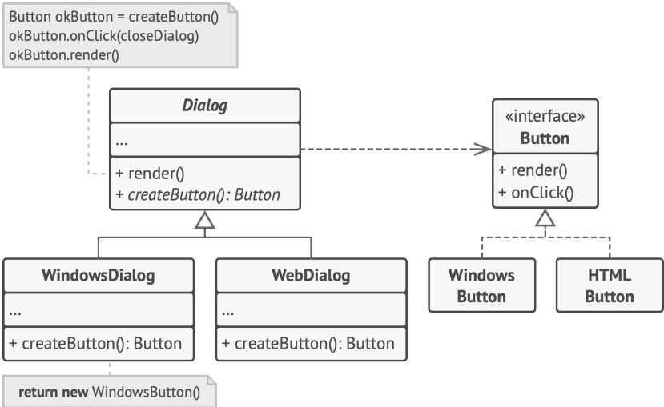

# Фабричный метод на примере диалогового окна

В этом примере Фабричный метод помогает создавать кросс-платформенные элементы интерфейса, не привязывая основной код программы к конкретным классам элементов.
Фабричный метод объявлен в классе диалогов. Его подклассы относятся к различным операционным системам. Благодаря фабричному методу, вам не нужно переписывать логику диалогов под каждую систему. Подклассы могут
наследовать почти весь код из базового диалога, изменяя типы кнопок и других элементов, из которых базовый код
строит окна графического пользовательского интерфейса.

Пример кросс-платформенного диалога

Базовый класс диалогов работает с кнопками через их общий программный интерфейс. Поэтому, какую вариацию
кнопок ни вернул бы фабричный метод, диалог останется рабочим. Базовый класс не зависит от конкретных классов
кнопок, оставляя подклассам решение о том, какой тип кнопок создавать.

Такой подход можно применить и для создания других элементов интерфейса. Хотя каждый новый тип элементов
будет приближать вас к Абстрактной фабрике

