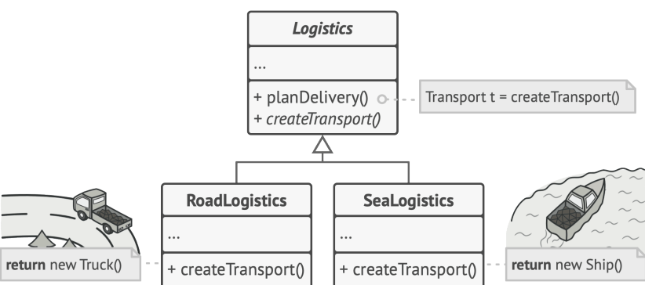
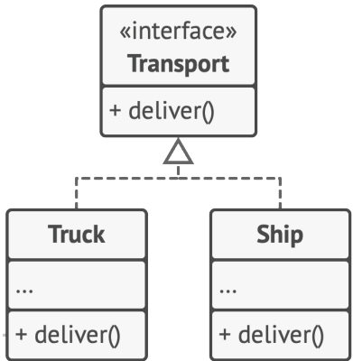
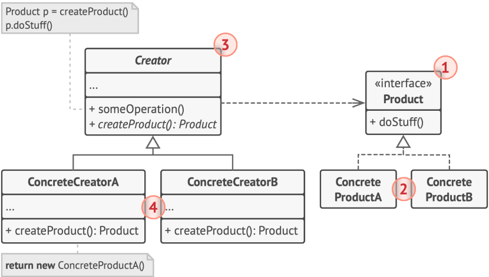

# Фабричный метод

Представьте, что вы создаёте программу управления грузовыми перевозками. Сперва вы рассчитываете перевозить
товары только на автомобилях. Поэтому весь ваш код работает с объектами класса Грузовик .
В какой-то момент ваша программа становится настолько известной, что морские перевозчики выстраиваются в очередь и просят добавить поддержку морской логистики в программу.

Большая часть существующего кода жёстко привязана к классам Грузовиков . Чтобы добавить в программу классы морских Судов , понадобится перелопатить всю программу. Более того, если вы потом решите добавить в программу ещё один вид транспорта, то всю эту работу придётся повторить

Паттерн Фабричный метод предлагает создавать объекты не напрямую, используя оператор new , а через вызов особого
фабричного метода.

На первый взгляд, это может показаться бессмысленным: мы просто переместили вызов конструктора из одного конца
программы в другой. Но теперь вы сможете переопределить фабричный метод в подклассе, чтобы изменить тип создаваемого продукта.

Чтобы эта система заработала, все возвращаемые объекты должны иметь общий интерфейс. Подклассы смогут производить объекты различных классов, следующих одному и тому же интерфейсу.

Например, классы Грузовик и Судно реализуют интерфейс Транспорт с методом доставить . Каждый из этих
классов реализует метод по-своему: грузовики везут грузы по земле, а суда — по морю. Фабричный метод в классе ДорожнойЛогистики вернёт объект-грузовик, а класс МорскойЛогистики — объект-судно.

Для клиента фабричного метода нет разницы между этими объектами, так как он будет трактовать их как некий
абстрактный Транспорт .
Для него будет важно, чтобы объект имел метод доставить , а как конкретно он работает — не важно.

## Структура

Рассмотрим подробнее структуру

1. Продукт определяет общий интерфейс объектов, которые может произвести создатель и его подклассы.
2. Конкретные продукты содержат код различных продуктов. Продукты будут отличаться реализацией, но интерфейс у
   них будет общий.
3. Создатель объявляет фабричный метод, который должен возвращать новые объекты продуктов. Важно, чтобы тип
   результата совпадал с общим интерфейсом продуктов. Зачастую фабричный метод объявляют абстрактным, чтобы
   заставить все подклассы реализовать его по-своему. Но он может возвращать и некий стандартный продукт
4. Конкретные создатели по-своему реализуют фабричный метод, производя те или иные конкретные продукты.

> Несмотря на название, важно понимать, что создание продуктов не является единственной функцией создателя.
Обычно он содержит и другой полезный код работы с продуктом. Аналогия: большая софтверная компания может
иметь центр подготовки программистов, но основная задача компании — создавать программные продукты, а не готовить программистов.

> Фабричный метод не обязан всё время создавать новые объекты. Его можно переписать так, чтобы возвращать существующие объекты из какого-то хранилища или кэша.

## Шаги реализации

1. Приведите все создаваемые продукты к общему интерфейсу.
2. В классе, который производит продукты, создайте пустой фабричный метод. В качестве возвращаемого типа укажите
   общий интерфейс продукта.
3. Затем пройдитесь по коду класса и найдите все участки, создающие продукты. Поочерёдно замените эти участки
   вызовами фабричного метода, перенося в него код создания различных продуктов. В фабричный метод, возможно, придётся добавить несколько параметров, контролирующих, какой из продуктов нужно
   создать. На этом этапе фабричный метод, скорее всего, будет выглядеть удручающе. В нём будет жить большой условный оператор, выбирающий класс создаваемого продукта. Но не волнуйтесь, мы вот-вот исправим это.
4. Для каждого типа продуктов заведите подкласс и переопределите в нём фабричный метод. Переместите туда код
   создания соответствующего продукта из суперкласса.
5. Если создаваемых продуктов слишком много для существующих подклассов создателя, вы можете подумать о введении параметров в фабричный метод, которые позволят возвращать различные продукты в пределах одного
   подкласса.
   Например, у вас есть класс Почта с подклассами АвиаПочта и НаземнаяПочта , а также классы продуктов
   Самолёт , Грузовик и Поезд . Авиа соответствует Самолётам , но для НаземнойПочты есть сразу два продукта. Вы могли бы создать новый подкласс почты для поездов, но проблему можно решить и по-другому. Клиентский код
   может передавать в фабричный метод НаземнойПочты аргумент, контролирующий тип создаваемого продукта.
6. Если после всех перемещений фабричный метод стал пустым, можете сделать его абстрактным. Если в нём что-то осталось — не беда, это будет его реализацией по умолчанию.

## Преимущества и недостатки

+ Избавляет класс от привязки к конкретным классам продуктов.
+ Выделяет код производства продуктов в одно место, упрощая поддержку кода.
+ Упрощает добавление новых продуктов в программу.
+ Реализует принцип открытости/закрытости.
- Может привести к созданию больших параллельных иерархий классов, так как для каждого класса продукта надо
создать свой подкласс создателя.

## Отношения с другими паттернами

- Многие архитектуры начинаются с применения Фабричного метода (более простого и расширяемого через подклассы) и
  эволюционируют в сторону Абстрактной фабрики, Прототипа или Строителя (более гибких, но и более сложных).
- Классы Абстрактной фабрики чаще всего реализуются с помощью Фабричного метода, хотя они могут быть построены и на основе Прототипа.
- Фабричный метод можно использовать вместе с Итератором, чтобы подклассы коллекций могли создавать подходящие им итераторы.
- Прототип не опирается на наследование, но ему нужна сложная операция инициализации. Фабричный метод, наоборот, построен на наследовании, но не требует сложной инициализации.
- Фабричный метод можно рассматривать как частный случай Шаблонного метода. Кроме того, Фабричный метод нередко
  бывает частью большого класса с Шаблонными методами.

