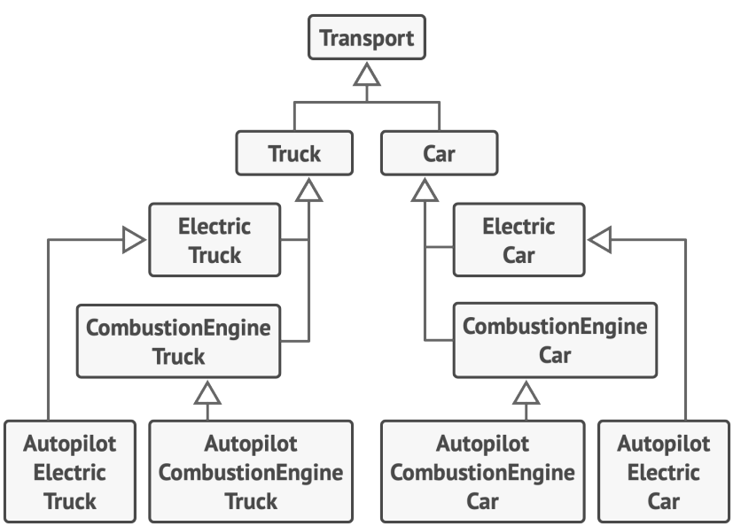
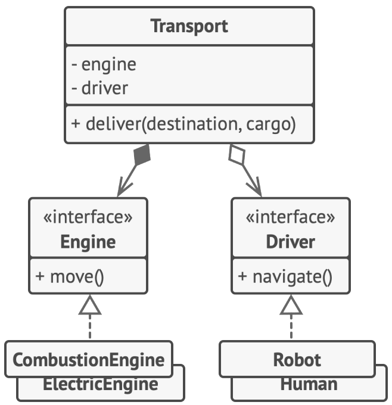

# Предпочитайте композицию наследованию

Наследование — это самый простой и быстрый способ повторного использования кода между классами. У вас есть
два класса с дублирующимся кодом. Создайте для них общий базовый класс и перенесите в него общее поведение.

Но у наследования есть и проблемы, которые становятся очевидными только тогда, когда программа уже обросла
классами, и изменить ситуацию довольно тяжело. Вот некоторые их возможных проблем с наследованием.

1. Подкласс не может отказаться от реализации своего родителя. Вы должны будете реализовать все
   абстрактные методы родителя, даже если они не нужны для конкретного подкласса
2. Переопределяя методы родителя, вы должны заботиться о    том, чтобы не сломать базовое поведение суперкласса. Это    важно, ведь подкласс может быть использован в любом коде, работающим с суперклассом
3. Наследование нарушает инкапсуляцию суперкласса, так как    подклассам доступны детали родителя. Суперклассы могут сами стать зависимыми от подклассов, например, если программист вынесет в суперкласс какие-то общие детали подклассов, чтобы облегчить дальнейшее наследование
4. Подклассы слишком тесно связаны с родительским классом. Любое изменение в родителе может сломать поведение в
   подклассах.
5. Повторное использование кода через наследование может привести к разрастанию иерархии классов.

> У наследования есть альтернатива, называемая композицией. Если наследование можно выразить словом «является»
(автомобиль является транспортом), то композицию — словом «содержит» (автомобиль содержит двигатель).

Этот принцип распространяется и на агрегацию — более свободный вид композиции, когда два объекта являются
равноправными, и ни один из них не управляет жизненным циклом другого. Оцените разницу: автомобиль содержит и
водителя, но тот не привязан к авто

# Пример

Предположим, вам нужно смоделировать модельный ряд автопроизводителя. У вас есть легковые автомобили и грузовики. Причём они бывают с электрическим двигателем и с двигателем на бензине. К тому же они отличаются режимами навигации: есть модели с ручным управлением и автопилотом.

Посмотрим, что как нам поможет наследование

Это какой-то ужас.
Как видите, каждый такой параметр приводит к умножению количества классов. Кроме того, возникает проблема дублирования кода, так как подклассы не могут наследовать нескольких родителей одновременно.

Решить проблему можно с помощью композиции. Вместо того, чтобы объекты сами реализовывали то или иное поведение, они могут делегировать его другим объектам

Композиция даёт вам и другое преимущество. К примеру, теперь вы можете заменить тип двигателя автомобиля
прямо во время выполнения программы, подставив в объект транспорта другой объект двигателя.

Посмотрим, что нам даст композиция

