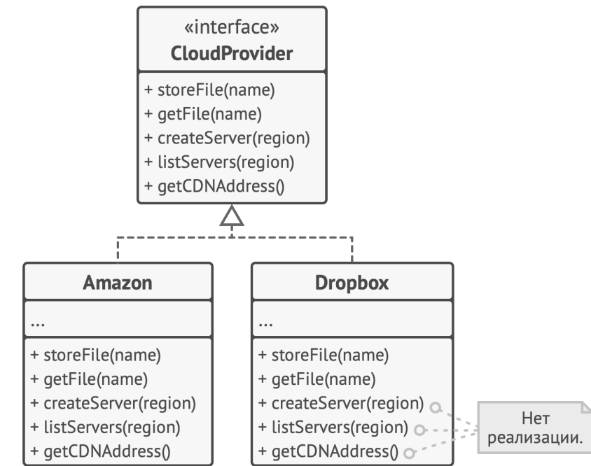
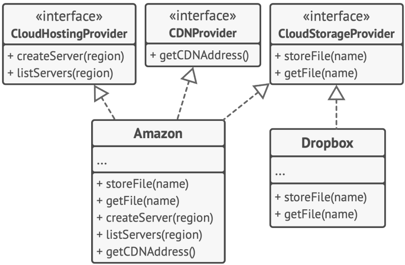

# Solid

соблюдение этих принципов имеет свою цену. Здесь это в основном выражается в усложнении кода программы. В реальной жизни, пожалуй, нет такого кода, в котором бы соблюдались все эти принципы сразу. Поэтому помните о балансе и не воспринимайте всё изложенное как догму.

## Single Responsibilit Principle Единственной ответственности

У класса должен быть только один мотив для изменения.

Стремитесь к тому, чтобы каждый класс отвечал только за одну часть функциональности программы, причём она
должна быть полностью инкапсулирована в этот класс (читай, скрыта внутри класса).

Если класс делает слишком много вещей сразу, вам приходится изменять его каждый раз, когда одна из этих вещей
изменяется. При этом есть риск сломать остальные части класса, которые вы даже не планировали трогать

Класс Employee имеет сразу несколько причин для изменения. Первая связана с основной задачей класса — управлением данными сотрудника. Но есть и вторая: изменения, связанные с форматированием отчёта для печати, будут затрагивать класс сотрудников.

Проблему можно решить, выделив операцию печати в отдельный класс.

## Open/Closed Principle  Открытости закрытости

Расширяйте классы, но не изменяйте их первоначальный код.

Стремитесь к тому, чтобы классы были открыты для расширения, но закрыты для изменения. Главная идея этого
принципа в том, чтобы не ломать существующий код при внесении изменений в программу.

Если класс уже был написан, внесён в библиотеку, после этого пытаться модифицировать его содержимое нежелательно. Вместо этого вы можете создать подкласс и расширить в нём базовое поведение, не изменяя код родительского класса напрямую

Но не стоит следовать этому принципу буквально. Если вам нужно исправить ошибку в исходном классе, просто возьмите и сделайте это. Нет смысла решать проблему родителя в дочернем классе.

Класс заказов имеет метод расчёта стоимости доставки, причём способы доставки «зашиты» непосредственно в сам
метод. Если вам нужно будет добавить новый способ доставки, то придётся трогать весь класс Order

Проблему можно решить, если применить паттерн Стратегия. Для этого нужно выделить способы доставки в собственные классы с общим интерфейсом.

Теперь при добавлении нового способа доставки нужно будет реализовать новый класс интерфейса доставки, не
трогая класс заказов.

## Liskov Substitution Principle принцип Барары Лисков

Подклассы должны дополнять, а не замещать поведение базового класса

Стремитесь создавать подклассы таким образом, чтобы их объекты можно было бы подставлять вместо объектов базового класса, не ломая при этом функциональности клиентского кода.

Принцип подстановки — это ряд проверок, которые помогают предсказать, останется ли подкласс совместим с остальным кодом программы, который до этого успешно работал, используя объекты базового класса.

Этот принцип подстановки имеет ряд формальных требований к подклассам, а точнее,
к переопределённым в них методам

1. Типы параметров метода подкласса должны совпадать или    быть более абстрактными (общим), чем типы параметров базового метода.
Example:
   Базовый класс содержит метод feed(Cat c) , который умеет кормить домашних котов. Клиентский код это знает
   и всегда передаёт в метод кота.
Хорошо: Вы создали подкласс и переопределили метод кормёжки так, чтобы накормить любое животное:
   feed(Animal c) . Если подставить этот подкласс в клиентский код, то ничего страшного не произойдёт. Клиентский код подаст в метод кота, но метод умеет кормить всех животных, поэтому накормит и кота.
Плохо: Вы создали другой подкласс, в котором метод умеет кормить только бенгальскую породу котов (подкласс котов): feed(BengalCat c) . Что будет с клиентским кодом? Он всё так же подаст в метод обычного кота. Но
   метод умеет кормить только бенгалов, поэтому не сможет отработать, сломав клиентский код.

2. Тип возвращаемого значения метода подкласса должен совпадать или быть подтипом возвращаемого значения базового метода. Здесь всё то же, что и в предыдущем пункте, но наоборот.
Example:
   Базовый метод: buyCat(): Cat . Клиентский код ожидает на выходе любого домашнего кота.
Хорошо: Метод подкласса: buyCat(): BengalCat . Клиентский код получит бенгальского кота, который является
   домашним котом, поэтому всё будет хорошо.
Плохо: Метод подкласса: buyCat(): Animal . Клиентский
   код сломается, так как это непонятное животное (возможно, крокодил) не поместится в ящике-переноске для кота

3. Метод не должен выбрасывать исключения, которые не свойственны базовому методу. Типы исключений в переопределённом методе должны совпадать или быть подтипами исключений, которые выбрасывает базовый метод.
   Блоки try-catch в клиентском коде нацелены на конкретные типы исключений, выбрасываемые базовым методом.
   Поэтому неожиданное исключение, выброшенное подклассом, может проскочить сквозь обработчики клиентского
   кода и обрушить программу.

4. Метод не должен ужесточать пред-условия. Например, базовый метод работает с параметром типа int . Если подкласс требует, чтобы значение этого параметра к тому же было больше нуля, то это ужесточает предусловия. Клиентский код, который до этого отлично работал, подавая в метод негативные числа, теперь сломается при работе с объектом подкласса

5. Метод не должен ослаблять пост-условия. Например, базовый метод требует, чтобы по завершению метода все подключения к базе данных были закрыты, а подкласс оставляет эти подключения открытыми, чтобы потом
   повторно использовать. Но клиентский код базового класса ничего об этом не знает. Он может завершить программу сразу после вызова метода, оставив запущенные процессыпризраки в системе.

6. Инварианты класса должны остаться без изменений. Инвариант — это набор условий, при которых объект имеет
   смысл. Например, инвариант кота — это наличие четырёх лап, хвоста, способность мурчать и прочее. Инвариант
   может быть описан не только явным контрактом или проверками в методах класса, но и косвенно, например, юниттестами или клиентским кодом.  Этот пункт проще всего нарушить при наследовании, так как
   вы можете попросту не подозревать о каком-то из условий инварианта сложного класса. Идеальным в этом отношении был бы подкласс, который только вводит новые методы и поля, не прикасаясь к полям базового класса.

7. Подкласс не должен изменять значения приватных полей базового класса. Этот пункт звучит странно, но в некоторых языках доступ к приватным полям можно получить через механизм рефлексии. В некоторых других языках (Python, JavaScript) и вовсе нет жёсткой защиты приватных полей.

В большинстве современных языков программирования, особенно строго типизированных (Java, C# и другие), первые три перечисленные ограничения встроены прямо в компилятор. Поэтому вы попросту не сможете собрать 
программу, нарушив их.

# Interface Segregation Principle разделение интерфейса

Клиенты не должны зависеть от методов, которые они не используют.

Стремитесь к тому, чтобы интерфейсы были достаточно узкими, чтобы классам не приходилось реализовывать
избыточное поведение.

слишком «толстые» интерфейсы необходимо разделять на более маленькие и специфические, чтобы клиенты маленьких
интерфейсов знали только о методах, которые необходимы им в работе. В итоге при изменении метода интерфейса не должны меняться клиенты, которые этот метод не используют.

Большинство объектных языков программирования позволяют классам реализовывать сразу несколько интерфейсов, поэтому нет нужды заталкивать в ваш интерфейс больше поведений, чем он того требует. Вы всегда можете присвоить классу сразу несколько интерфейсов поменьше. 

Например
Представьте библиотеку для работы с облачными провайдерами. В первой версии она поддерживала только Amazon,
имеющий полный набор облачных услуг. Исходя из них и проектировался интерфейс будущих классов.
Но позже стало ясно, что получившийся интерфейс облачного провайдера слишком широк, так как есть другие провайдеры, реализующие только часть из всех возможных сервисов.

Чтобы не плодить классы с пустой реализацией, раздутый интерфейс можно разбить на части. Классы, которые были
способны реализовать все операции старого интерфейса, могут реализовать сразу несколько новых частичных интерфейсов

# Dependency Inversion Principle

