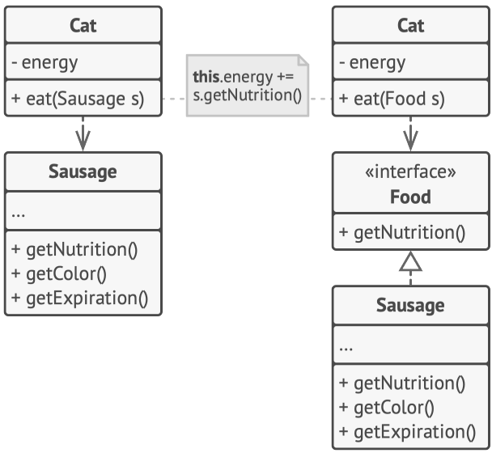
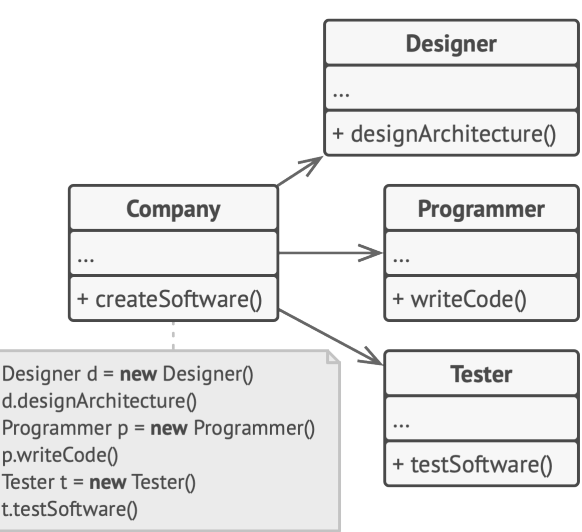
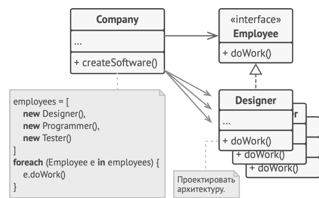
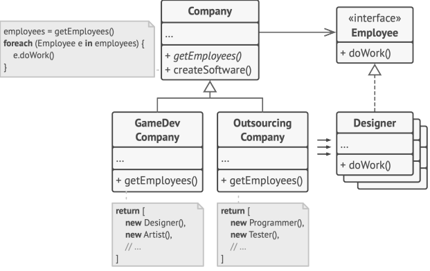

# 03 Базовые принципы проектирования

Что такое хороший дизайн? По каким критериям его оценивать и каких правил придерживаться при разработке? Как
обеспечить достаточный уровень гибкости, связанности, управляемости, стабильности и понятности кода?

большинство паттернов основаны именно на перечисленных ниже принципах.

## Инкапсулируйте то, что меняется

> Определите аспекты программы, класса или метода, которые меняются чаще всего, и отделите их от того,
что остаётся постоянным.

Этот принцип преследует единственную цель — уменьшить последствия, вызываемые изменениями.
Представьте, что ваша программа — это корабль, а изменения — коварные мины, которые его подстерегают. Натыкаясь
на мину, корабль заполняется водой и тонет.
Зная это, вы можете разделить корабль на независимые секции, проходы между которыми можно наглухо задраивать. Теперь при встрече с миной корабль останется на плаву. Вода затопит лишь одну секцию, оставив остальные
без изменений.
Изолируя изменчивые части программы в отдельных модулях, классах или методах, вы уменьшаете количество кода,
который затронут последующие изменения. Следовательно, вам нужно будет потратить меньше усилий на то, чтобы привести программу в рабочее состояние, отладить и протестировать изменившийся код

### Пример инкапсуляции на уровне метода

Представьте, что вы разрабатываете интернет-магазин. Гдето внутри вашего кода может существовать метод
getOrderTotal , который рассчитывает финальную сумму заказа, учитывая размер налога.
Мы можем предположить, что код вычисления налогов, скорее всего, будет часто меняться. Во-первых, логика начисления налога зависит от страны, штата и даже города, в
котором находится покупатель. К тому же размер налога непостоянен

Из-за этих изменений вам постоянно придётся трогать метод getOrderTotal , который, по правде, не особо интересуется деталями вычисления налогов.

'''
method getOrderTotal(order) is
total = 0
foreach item in order.lineItems
total += item.price * item.quantity

if (order.country == "US")
total += total * 0.07 // US sales tax
else if (order.country == "EU")
total += total * 0.20 // European VAT

return tota
'''

>правила вычисления налогов смешаны с основным кодом метода.

Вы можете перенести логику вычисления налогов в собственный метод, скрыв детали от оригинального метода.

'''
method getOrderTotal(order) is
total = 0
foreach item in order.lineItems
total += item.price * item.quantity

total += total * getTaxAmount(order.country)

return total

method getTaxAmount(country) is
if (country == "US")
return 0.07 // US sales tax
else if (country == "EU")
return 0.20 // European VAT
else
return 0
'''

Теперь изменения налогов будут изолированы в рамках одного метода. Более того, если логика вычисления налогов станет ещё более сложной, вам будет легче извлечь этот метод в собственный класс.

### Пример инкапсуляции на уровне класса

Объекты заказов станут делегировать вычисление налогов отдельному объекту-калькулятору налогов.

### Программируйте на уровне интерфейса

> Программируйте на уровне интерфейса, а не на уровне реализации. Код должен зависеть от абстракций, а не конкретных классов

Когда вам нужно наладить взаимодействие между двумя объектами разных классов, вы можете начать с того, что
попросту сделаете один класс зависимым от другого. Но есть и другой, более гибкий, способ.
1. Определите, что именно нужно одному объекту от другого,    какие методы он вызывает.
2. Затем опишите эти методы в отдельном интерфейсе.
3. Сделайте так, чтобы класс-зависимость следовал этому интерфейсу. Скорее всего, нужно будет только добавить этот    интерфейс в описание класса.
4. Теперь вы можете сделать и второй класс зависимым от    интерфейса, а не конкретного класса.

Для примера вернёмся к классу котов. Класс Кот , который ест только сардельки, будет менее гибким, чем тот, который может есть любую еду. Но при этом последнего можно будет кормить и сардельками, ведь они являются едой.

До и после извлечения интерфейса.
Код справа более гибкий, чем тот, что слева, но и более сложный.

Проделав всё это вы, скорее всего, не получите немедленной выгоды. Но зато в будущем вы сможете использовать
альтернативные реализации классов, не изменяя использующий их код.

### Еще один пример

Представьте, что вы делаете симулятор софтверной компании. У вас есть различные классы
работников, которые делают ту или иную работу внутри компании.

классы жёстко связаны

Вначале класс компании жёстко привязан к конкретным классам работников. Несмотря на то, что каждый тип работников делает разную работу, мы можем свести их методы работы к одному виду, выделив для всех классов общий
интерфейс.

Сделав это, мы сможем применить полиморфизм в классе компании, трактуя всех работников единообразно через
интерфейс Employee

полиморфизм помог упростить код, но основной код компании всё ещё зависит от конкретных классов сотрудников

Тем не менее, класс компании всё ещё остаётся жёстко привязанным к конкретным классам работников. Это не очень
хорошо, особенно, если предположить, что нам понадобится реализовать несколько видов компаний. Все эти компании будут отличаться тем, какие конкретно работники в них нужны.
Мы можем сделать метод получения сотрудников в базовом классе компании абстрактным. Конкретные компании
должны будут сами позаботиться о создании объектов сотрудников. А значит, каждый тип компаний сможет иметь
собственный набор сотрудников

После этого изменения код класса компании стал окончательно независимым от конкретных классов. Теперь мы
можем добавлять в программу новые виды работников и компаний, не внося изменений в основной код базового
класса компаний.

'''

'''

'''
