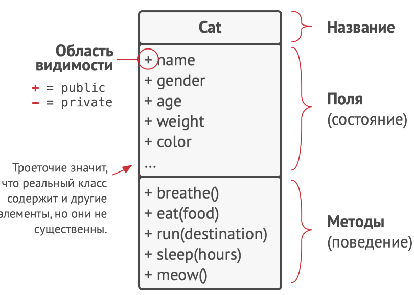
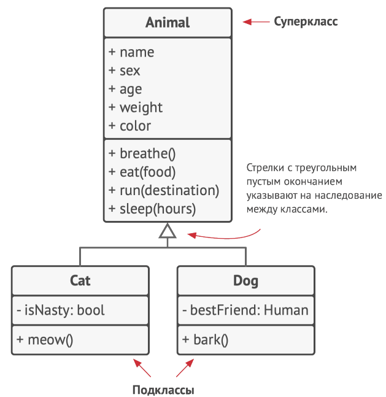
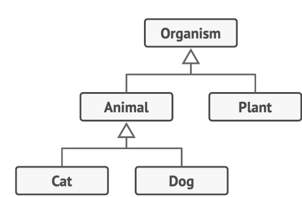
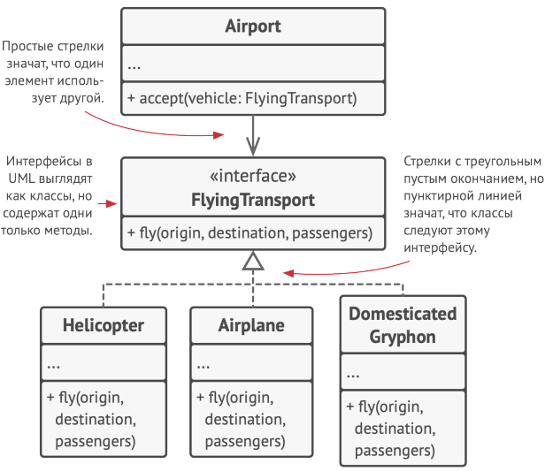
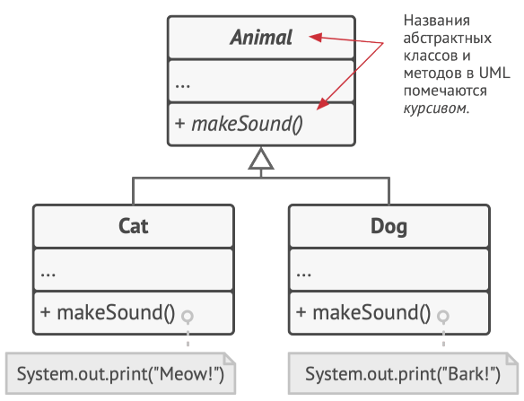

# Изучаем UML диаграммы

Вот пример просто UML-диаграммы

UML-диаграмма иерархии классов

UML-диаграмма иерархии классов более сложная

UML-диаграмма реализации и использования интерфейса.

Рассммотрим что на этой диаграмме
У нас есть класс Airport, который содержит метод с параметром интерфеса FlyingTransport.
Стрелка означает, что этот класс использует данный интерфейс
В свою очередь интерфейс FlyingTransport имеет три реализации, указанные ниже
Такая конструкция гарантирует, что класс Airport будет работать с любым классом, который реализует интерфес FlyingTransport

а вот как выглядят комментарии и абстрактные методы

Зависимость в UML-диаграммах. Профессор зависит от учебного курса

Зависимость — это базовая связь между классами, которая показывает, что один класс скорее всего придётся менять
при изменении названия или сигнатуры методов второго.
Зависимость появляется там, где вы указываете конкретные названия классов — в вызовах конструкторов, при указании типов параметров и возвращаемых значений методов и так далее. Степень зависимости можно ослабить, если вместо конкретных классов ссылаться на абстрактные классы или интерфейсы