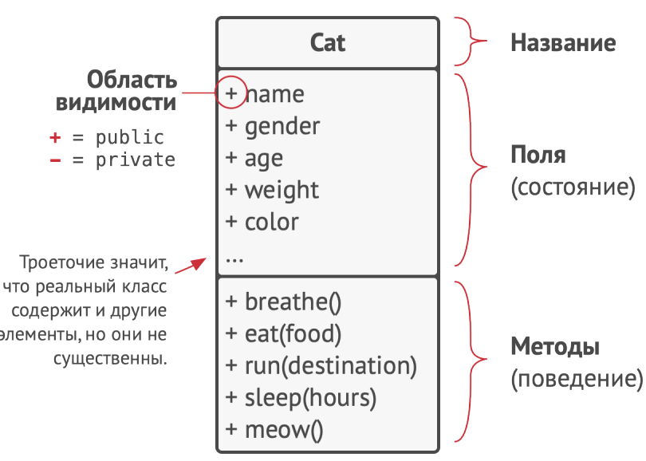
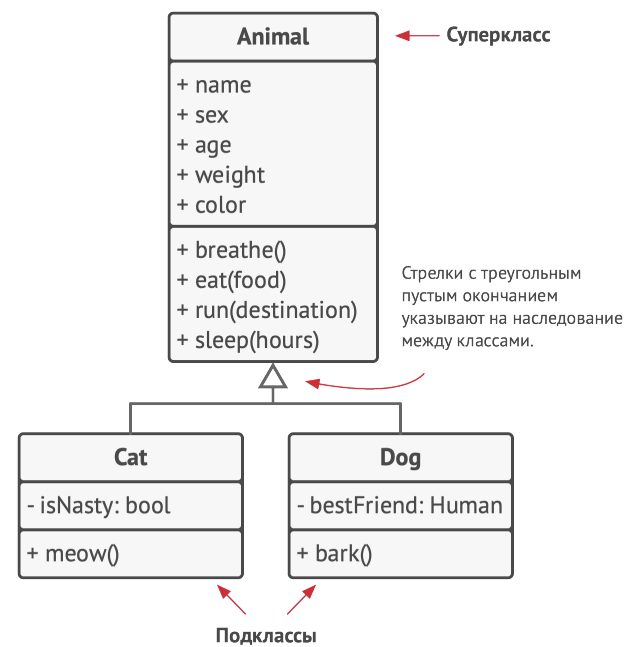
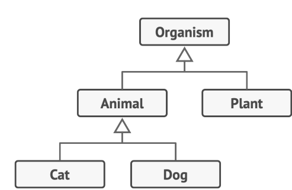
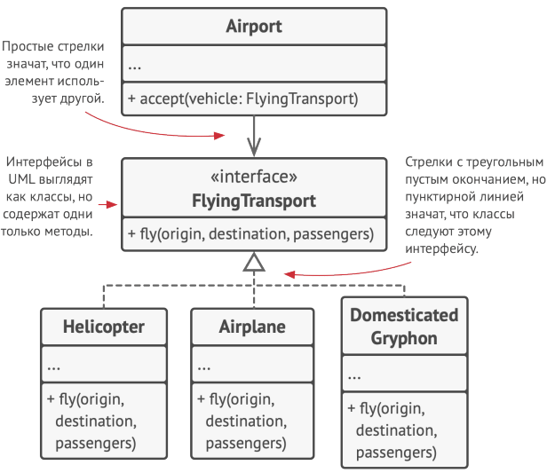
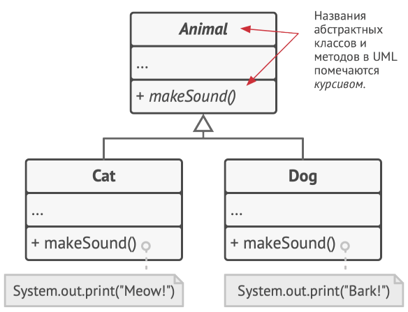
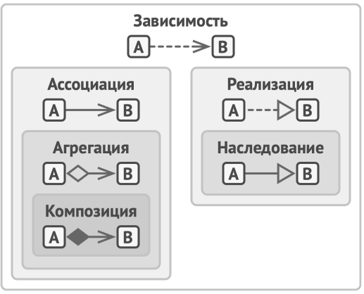

# Изучаем UML диаграммы

Вот пример просто UML-диаграммы




UML-диаграмма иерархии классов



UML-диаграмма иерархии классов более сложная



UML-диаграмма реализации и использования интерфейса.

Рассммотрим что на этой диаграмме
У нас есть класс Airport, который содержит метод с параметром интерфеса FlyingTransport.
Стрелка означает, что этот класс использует данный интерфейс
В свою очередь интерфейс FlyingTransport имеет три реализации, указанные ниже
Такая конструкция гарантирует, что класс Airport будет работать с любым классом, который реализует интерфес FlyingTransport



а вот как выглядят комментарии и абстрактные методы




Зависимость в UML-диаграммах. Профессор зависит от учебного курса


Зависимость — это базовая связь между классами, которая показывает, что один класс скорее всего придётся менять
при изменении названия или сигнатуры методов второго.
Зависимость появляется там, где вы указываете конкретные названия классов — в вызовах конструкторов, при указании типов параметров и возвращаемых значений методов и так далее. Степень зависимости можно ослабить, если вместо конкретных классов ссылаться на абстрактные классы или интерфейсы

Обычно UML-диаграмма не показывает все зависимости — их слишком много в любом реальном коде. Вместо загрязнения диаграммы зависимостями, вы должны быть очень избирательными и показывать только те из них, которые
важны для смысла, который вы хотите передать.


Ассоциация в UML-диаграммах. 


Ассоциация — это когда один объект взаимодействует с другим. В UML ассоциация обозначается простой стрелкой,
которая направлена в сторону взаимодействия. Двухсторонняя ассоциация между объектами тоже вполне допустима.

Ассоциацию можно рассматривать как строгий вариант зависимости, при котором один объект всегда имеет доступ
к объекту, с которым он взаимодействует, в то время как при простой зависимости связь может быть не постоянной и не такой явной.
К примеру, если один класс имеет поле-ссылку на другой класс, вы можете отобразить эту связь ассоциацией. Эта
связь постоянна, один объект всегда может достучаться до второго через это поле. Причём, роль поля может отыгрывать и метод, который возвращает объекты определённого класса.
Чтобы окончательно понять разницу между ассоциацией и зависимостью, давайте рассмотрим комбинированный пример. Представьте, что у нас есть класс Профессор :

```
class Professor is
field Student student
// ...
method teach(Course c) is
// ...
this.student.remember(c.getKnowledge())
```
Обратите внимание на метод научить , принимающий аргумент класса Курс , который далее используется в теле метода. Если метод получитьЗнания класса Курс изменит название, или в нем появятся какие-то обязательные параметры, или еще что-то — наш код сломается. Это — зависимость.
Теперь посмотрите на поле студент и на то, как это поле используется в методе научить . Мы можем точно сказать,
что класс Студент для профессора также является зависимостью, потому что если метод запомнить изменит название, то код профессора тоже сломается. Но благодаря тому, что значение поля Студент доступно для профессора всегда, из любого метода, класс Студент — это не просто зависимость, но еще и ассоциация.

Агрегация в UML-диаграммах


Агрегация — это специализированная разновидность ассоциации, которая описывает отношения один-ко-многим, многие-ко-многим, часть-целое между несколькими объектами, тогда как ассоциация устанавливает связь только между двумя объектами.
Обычно при агрегации один объект содержит другие, то есть выступает контейнером или коллекцией. Здесь контейнер не управляет жизненным циклом компонентов и компоненты вполне могут существовать отдельно от контейнера. В UML
агрегация обозначается линией со стрелкой на одном конце и пустым ромбом на другом конце. Ромб направлен в сторону контейнера, а стрелка — в сторону включаемого объекта.
Хотя мы подразумеваем связи между объектами, блоки на UML-диаграмме отображают отношения между классами.
Объект университета может состоять из несколько отделов, хотя вы увидите только один блок отдела на диаграмме. UML позволяет указывать количество объектов по обе стороны отношений, но их можно опустить, если количество и так понятно из контекста.

Композиция в UML-диаграммах


Композиция — это более строгий вариант агрегации, когда один объект состоит из других. Особенность этого отношения заключается в том, что компонент может существовать только как часть контейнера. В UML композиция изображается так же, как и агрегация, но с закрашенным ромбом.

### Резюме

- Зависимость: Класс А могут затронуть изменения в классе B.
- Ассоциация: Объект А знает об объекте B. Класс А зависит от B.
- Агрегация: Объект А знает об объекте B и состоит из него. Класс А зависит от B.
- Композиция:   Объект А знает об объекте B, состоит из него и управляет его жизненным циклом. Класс А зависит от B.
- Реализация: Класс А определяет методы объявленные   интерфейсом B. Объекты А можно рассматривать через
  интерфейс B. Класс А зависит от B.
- Наследование: Класс А наследует интерфейс и реализацию   класса B, но может переопределить её. Объекты А можно
  рассматривать через интерфейс класса B. Класс А зависит   от B

Связи между объектами и классами — от самой слабой, до самой сильной



